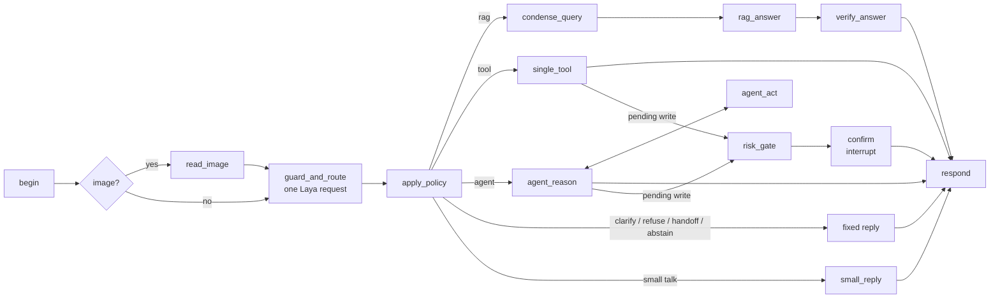
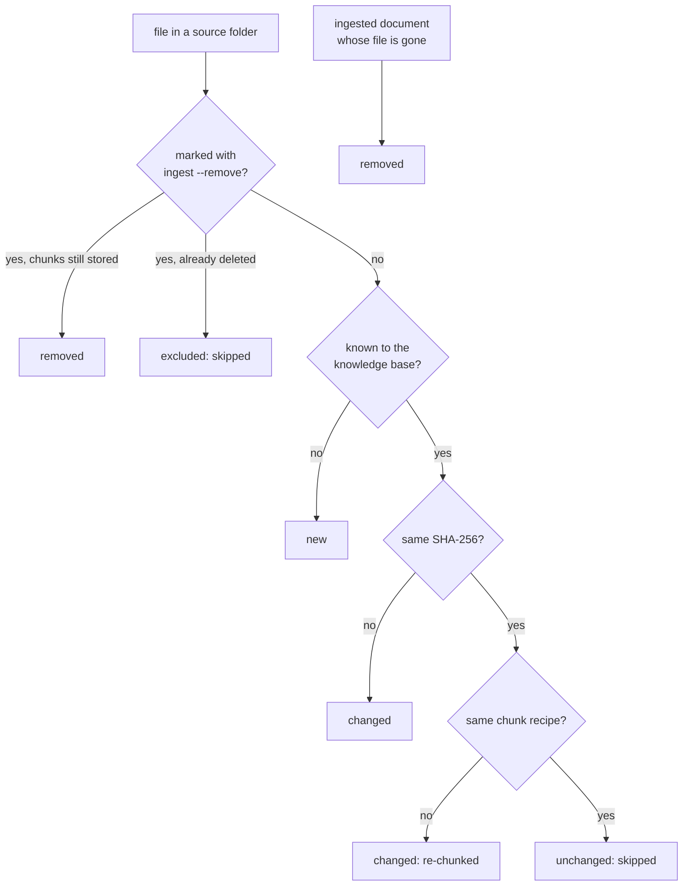

# Tutorial: building the campus copilot from start to end

This tutorial follows the chatbot from an empty machine to the finished system, one phase at a time.
Each phase states its objective, the code it adds, the commands that run it, what to check in the
output, and how to debug it when the output looks wrong. Read it in order: every phase builds on the
knowledge base, graph, or state the phase before it left behind.

The build-path chapters in `docs/build-path/` hold the same steps in short form, and each has an
automated checkpoint (`cli step N --check`). This tutorial adds the connecting story: why each phase
exists, how the pieces meet, and where to look inside a running turn.

## The end state

A Khmer-English campus assistant for CamTech University that:

- answers questions from CamTech's own documents (the prospectus PDF and the academic information pages),
  with a citation for every claim, and says so when the documents do not hold the answer;
- keeps a conversation in a thread and understands follow-ups such as "And for a master's degree?";
- decides what each message needs with a System One decision model (Laya): a document answer, a lookup,
  a clarifying question, a refusal, or a hand-off to a person;
- looks up timetables, rooms, books, weather, and exchange rates through registered tools;
- runs a bounded agent loop for multi-part requests and changes data only after an explicit confirmation;
- reads a photographed notice into a calendar event;
- leaves a trace of every turn, and an evaluation set measures it.

Every turn goes through one LangGraph graph. The finished graph, simplified:



`docs/architecture.md` has the compiled graph exported from the code.

## How the phases fit together

| Phase | Objective | Main code | Checkpoint |
|---:|---|---|---|
| 0 | a working environment, keys optional | `config.py`, `diagnostics.py`, `.env.example` | `cli check` |
| 1 | know which documents exist and whether they changed | `ingest/manifest.py`, `ingest/gather.py` | `step 1 --check` |
| 2 | plain text out of PDF and Markdown | `ingest/extract.py` | `step 2 --check` |
| 3 | clean text in token-sized, located chunks | `ingest/clean.py`, `ingest/chunk.py`, `ingest/tables.py` | `step 3 --check` |
| 4 | a verified, searchable knowledge base | `ingest/embed.py`, `ingest/store.py`, `ingest/verify.py` | `step 4 --check` |
| 5 | the first chatbot: retrieve, answer, cite, abstain | `rag/retrieve.py`, `rag/rerank.py`, `rag/answer.py` | `step 5 --check` |
| 6 | conversations and follow-ups | `graph/memory.py`, `rag/condense.py` | `step 6 --check` |
| 7 | route, clarify, refuse, hand off | `decisions/` | `step 7 --check` |
| 8 | answers from databases and APIs | `db/`, `tools/`, `graph/arguments.py` | `step 8 --check` |
| 9 | multi-step requests and safe writes | `graph/agent.py`, `risk_gate`, `confirm` | `step 9 --check` |
| 10 | the same tools over MCP | `mcp/` | `step 10 --check` |
| 11 | measured, traced, and hardened | `evaluation/`, `observability/`, guards | `step 11 --check` |
| 12 | images in, and the design written down | `multimodal/`, `docs/adr_template.md` | `step 12 --check` |

Phases 1-4 build the knowledge base once (`cli ingest` runs all four); the **Ingestion flows** section
after phase 4 shows how the same pipeline adds, updates, re-chunks, and removes documents afterwards.
Phases 5-12 add nodes to the graph. `cli step N --demo` runs the 14 demo turns against the chatbot
exactly as it stands after phase N, so the scoreboard grows as the phases add capabilities.

---

## Phase 0: Project setup

**Objective.** A Python environment where every command runs, in `offline` mode first, with live
services switched on one key at a time.

**Do.**

```bash
python -m venv .venv
source .venv/bin/activate                               # Windows PowerShell: .venv\Scripts\Activate.ps1
python -m pip install -r requirements.txt               # the prompt shows (.venv); re-activate in every new terminal
python -m campus_copilot.cli init-env                   # copies .env.example to .env; never overwrites
python -m campus_copilot.cli check                      # run mode, keys (state only), models, reachability
python -m campus_copilot.cli seed                       # the synthetic campus database (timetables, rooms, loans)
python -m pytest -q                                     # offline; sockets are blocked
```

**Run modes.** The keys present decide what runs live (`config.py`, `Settings.run_mode`):

| Mode | Needs | Live |
|---|---|---|
| `offline` | nothing | nothing: stub chat model, stub decider, hashing encoder, recorded API fixtures |
| `nim` | `NVIDIA_API_KEY` and/or `GEMINI_API_KEY` | chat and vision model, NIM embeddings and reranker; stub decider |
| `full` | the above + `pip install laya` | everything, Laya included |

Laya needs no key: `pip install laya` loads its checkpoints in-process (`LAYA_MODE=local`), or a
`laya-serve` process answers over HTTP (`LAYA_MODE=http`). See `docs/setup_keys.md` and
`docs/laya_primer.md`.

**Code to read.** `src/campus_copilot/config.py` (the `.env` search order, `DEFAULTS`, `Settings`),
`profiles/baseline.toml` (every tunable setting, with the experiment that varies it), and
`src/campus_copilot/cli.py` (every command is one small function).

**Check.** `cli check` prints the mode it chose and why. Every phase below works in `offline` mode;
answers are then labelled `STUB`.

**Debug.** A key that `cli check` reports as `placeholder` still holds the template value. A mode lower
than expected means a key is missing or `COPILOT_ENV_FILE` points at another file.

---

## Phase 1: Gather the sources

**Objective.** A listed, hashed, licence-checked set of documents: the only material the chatbot may
cite.

The knowledge source is CamTech's own published material, in `data/sources/`:

| source_id | File | What it holds |
|---|---|---|
| `camtech-prospectus` | `CamTech-Prospectus.pdf` | 28 pages: university background, programs, calendar, tuition, research centres, library, dormitory, sports |
| `academic-info` | `Academic_Info.md` | the academic information pages as Markdown: programs, terms, study sessions, tuition tables, scholarships, admission criteria, how to apply |

`data/sources/manifest.csv` records each file's id, format, licence, and origin;
`data/sources/probes.jsonl` holds questions each document must answer (used in phase 4).
`data/inbox/` is the drop folder for new documents (git-ignored).

**Code.** `ingest/manifest.py` reads and writes the manifests; `ingest/gather.py` scans the folders,
hashes every file, and marks it `new`, `changed`, `unchanged`, or `removed` against the knowledge base.

**Do.**

```bash
python -m campus_copilot.cli ingest --until gather
python -m campus_copilot.cli ingest --show gather
```

**Check.** Two documents, both `new` on the first run and `unchanged` on the second. The hash is what
makes re-ingestion incremental in phase 4.

**Debug.** A document missing from the list is missing from `manifest.csv` or sits outside the folders
in `ingest.sources`. A file without a licence is flagged, not silently used.

---

## Phase 2: Extract text

**Objective.** Plain text per PDF page and per Markdown file, with page numbers kept, because citations
point at pages.

**Code.** `ingest/extract.py`: `pypdf` text per page, Markdown bodies with any frontmatter moved into
metadata, and extraction checks that flag suspicious units.

**Do.**

```bash
python -m campus_copilot.cli ingest --until extract --show extract --doc camtech-prospectus
```

**Check.** One record per prospectus page. The prospectus is a designed brochure: several pages are
photographs with no text layer, so they come out empty and are flagged ("empty or near-empty page").
Where text exists it carries noise (`Cam Tech`, `~`, stray symbols). Both are the normal case for real
PDFs and both reach the answers later, which is why they are flagged here.

**Debug.** An answer that should come from the prospectus but never does: check whether that page is
one of the empty ones. OCR is out of scope, so such content is only reachable through the Markdown file.

---

## Phase 3: Clean and chunk

**Objective.** Clean text split into chunks small enough to embed and retrieve, each one located
(source, page or section) so it can be cited.

**Code.**

- `ingest/clean.py`: removes repeated headers and footers, page numbers, hyphen breaks, and the
  `<!-- image -->` comments the PDF-to-Markdown converter left behind.
- `ingest/tokens.py`: counts tokens with the embedder's tokenizer when it is published, else a
  labelled approximation.
- `ingest/chunk.py`: page-aware for PDFs (a chunk never crosses a page), section-aware for Markdown
  (each chunk carries its heading path, such as `IV. Tuition Fees › A) Bachelor's Degree`, and a
  `# Title › Section` breadcrumb in its text).
- `ingest/tables.py`: a wide table is split between rows, and every piece repeats the header, so the
  row `Cyber Security | $1,350 | ... | $4,000` still says which column is the yearly fee.

**Do.**

```bash
python -m campus_copilot.cli ingest --until chunk
python -m campus_copilot.cli ingest --show chunk --doc academic-info
```

**Check.** Chunk sizes cluster near `rag.chunk_size` tokens; no chunk exceeds the embedder window; the
tuition tables appear as several chunks, each with the header row.

**Debug.** A table answer that comes back without its column names: look at that chunk in
`--show chunk`. Experiment E02 varies the chunk size and unit (tokens vs characters) to show the
silent failures each choice causes.

---

## Phase 4: Embed, store, and verify

**Objective.** A knowledge base that can be searched two ways (keywords and meaning) and that proves it
works before any chatbot uses it.

**Code.**

- `ingest/embed.py`: embeds only chunks without a cached vector for the current model, in batches.
- `rag/embeddings.py`: the NIM embedder (`passage` and `query` input types) and the offline hashing
  encoder.
- `ingest/store.py`: `runs/kb.db` with the `chunks` table, an FTS5 index for keyword search, and the
  vector cache; `rag/stores/` holds the vector backends (SQLite + NumPy by default, `sqlite-vec`, Chroma).
- `ingest/verify.py`: row counts agree, every chunk has a vector and a locator, and each probe question
  in `probes.jsonl` finds its document in the top 3 (`hit@3`).

**Do.**

```bash
python -m campus_copilot.cli ingest                 # all seven stages
python -m campus_copilot.cli ingest                 # again: 0 embedding calls, every vector cached
python -m campus_copilot.cli ingest --show verify
```

**Check.** `verify PASS: probe hit@3 = ...` at or above `ingest.verify_min_hit_rate` (0.8). The second
run reports 0 embedding calls.

**Debug.** A failing probe lists the top 3 it got instead; run that question through
`cli retrieve "..." --stages` (phase 5) to see which stage lost the right chunk. In `offline` mode the
dense stage uses the hashing encoder; vectors are cached per encoder, so switching between `offline`
and `nim` needs one `cli ingest` in the new mode before dense search returns anything.

---

## Ingestion flows

Phases 1-4 built the knowledge base once. After that the documents keep changing: a new notice arrives,
the prospectus is revised, an old file is withdrawn, an experiment changes the chunk size. This section
shows how one pipeline handles every one of those cases, so the knowledge base never has to be rebuilt
from scratch.

### One run, seven stages

`cli ingest` (`ingest/pipeline.py · run_ingest`) runs the stages in order. Each stage reads the previous
stage's file from `runs/ingest/<run_id>/` and writes its own, and `run.json` records each stage's
status, statistics, and time.

```mermaid
flowchart LR
  SRC[(data/sources/<br/>data/inbox/)] --> G[gather<br/>01_manifest.jsonl]
  G --> X[extract<br/>02_extracted.jsonl]
  X --> C[clean<br/>03_clean.jsonl]
  C --> K[chunk<br/>04_chunks.jsonl]
  K --> E[embed<br/>05_embed_log.jsonl]
  E --> S[store<br/>06_store.json]
  S --> V[verify<br/>07_verify.json]
  E <-.-> CACHE[(embedding_cache)]
  S --> KB[(runs/kb.db<br/>documents · chunks · chunks_fts)]
  S --> VS[(vector stores<br/>sqlite · sqlite_vec · chroma)]
  V -.probes.jsonl.-> KB
```

Three properties make the flows below work:

- **Only what changed is processed.** `gather` gives every document a status. `extract`, `clean`, and
  `chunk` handle only `new` and `changed` documents; `store` deletes and replaces the chunks of those
  documents and of `removed` ones, and leaves the rest alone.
- **Embeddings are cached by content.** The cache key is the chunk text's SHA-256 plus the embedding
  model and input type. Identical text is never embedded twice, even after a re-chunk moves it.
- **Every stage leaves a file.** `cli ingest --show STAGE [--doc SOURCE_ID]` prints the latest run's
  file for that stage; `--until STAGE` stops early; `--resume RUN_ID` continues a failed run.

### How gather decides what to do with a document

`ingest/gather.py` compares each file with its row in the `documents` table of `runs/kb.db`:



The **chunk recipe** is a fingerprint of the chunker version and every setting that shapes chunks
(`rag.chunk_size`, `rag.chunk_overlap`, `rag.length_unit`, `rag.tokenizer`, `ingest.markdown_split`,
`ingest.tables`, `ingest.context_header`, `ingest.clean.strip_headers`). It is stored per document, so a
change to any of these settings re-chunks every document on the next run without a file changing.

Gather also flags, without stopping: an unknown licence, a missing origin, a duplicate file (same
SHA-256 as another document), a file over 20 MB, a PDF with no readable pages, and a file not listed in
any manifest (registered automatically with the file name as its `source_id`). Unsupported formats are
listed as skipped; only PDF and Markdown are ingested.

### Flow A: the first build

```bash
python -m campus_copilot.cli ingest
```

Both documents are `new`; every stage runs; every chunk is embedded. The last line is the verify
verdict. A `FAIL` makes the command exit with status 1, so a script or CI job can stop on it.

### Flow B: nothing changed

```bash
python -m campus_copilot.cli ingest
```

Both documents are `unchanged`. Extract, clean, and chunk produce nothing; embed reports `0 embedded`
and every vector as a cache hit; store inserts and deletes 0 chunks; verify runs the probes again. This
is the run to repeat whenever the state of the knowledge base is unclear: it is cheap and it
re-checks everything.

### Flow C: add a document

Four ways in, one pipeline:

| Way in | Command or action | Where the metadata goes |
|---|---|---|
| a local file | `cli ingest add path/to/notice.pdf --licence "CC-BY-4.0" --origin "https://..." --title "..." --language en` | a row in `data/inbox/manifest.csv` |
| a URL | `cli ingest add --url https://.../notice.pdf --licence "CC-BY-4.0"` | the same; the URL becomes the origin |
| the app | `cli ui` → Knowledge Base tab → upload, licence, origin, **Add** | the same |
| a plain copy | drop the file into `data/inbox/` | registered on the next run, flagged `licence unknown` |

Then run the pipeline and check the new document:

```bash
python -m campus_copilot.cli ingest
python -m campus_copilot.cli ingest --show gather                       # the new document is `new`
python -m campus_copilot.cli ingest --show chunk --doc <source_id>      # its chunks and locators
python -m campus_copilot.cli retrieve "a question only this document answers" --stages
```

Only the new document is extracted, chunked, and embedded. Verify only runs probes for documents that
have chunks, so a new document has no probe yet: add one or more lines to `data/inbox/probes.jsonl`
(`{"question": "...", "source_id": "...", "page": 2}` or `"section_contains": "..."`), or let the chat
model write one with `cli ingest --gen-probes` (saved to `runs/ingest/generated_probes.jsonl`, labelled
`generated`). A document without a probe is stored but never checked.

The inbox is git-ignored. To make a document part of the committed pack, move it to `data/sources/`,
add its row to `data/sources/manifest.csv`, and its probes to `data/sources/probes.jsonl`.

### Flow D: a document changes

Replace the file under the same name and run `cli ingest`. The new SHA-256 makes it `changed`: its old
chunks are deleted from `chunks`, `chunks_fts`, and every vector store, and its new chunks are inserted.
Chunks whose text did not change keep their cached vectors, so a small edit costs a few embedding calls,
not a whole document. `--show store` reports `+inserted / -deleted`.

Renaming the file is a different case. If its manifest row is renamed with it, the `source_id` and the
SHA-256 stay the same and the document is `unchanged`. If not, the file is registered under a new
`source_id` from its new name: the old document becomes `removed` and the new one `new`.

### Flow E: chunk settings change

Change any recipe setting (in a profile, or `profiles/baseline.toml`) and run `cli ingest`. Every
document becomes `changed` with the flag `chunk settings or chunker version changed: re-chunked`. This
is what experiment E02 relies on. Because the default runs folder holds one knowledge base, E02 gives
each profile its own folder so the variants can be compared side by side:

```bash
export COPILOT_RUNS_DIR=runs/e02-small       # PowerShell: $env:COPILOT_RUNS_DIR = "runs/e02-small"
python -m campus_copilot.cli --profile e02_chunk_small ingest
```

### Flow F: remove a document

```bash
python -m campus_copilot.cli ingest --remove <source_id>    # or the Remove button in the app
python -m campus_copilot.cli ingest
```

`--remove` only marks the document `excluded`; the next run sees it as `removed`, deletes its chunks from
every store, and moves an inbox file to `runs/removed_inbox/`. The mark persists: the file can stay in
place and it will not come back. Deleting the file from a source folder has the same effect on the next
run, flagged `file no longer present`.

### Flow G: switch the embedder or the vector store

Vectors are cached per encoder. Moving from `offline` (hashing encoder) to `nim` (NVIDIA embeddings),
or changing `NIM_EMBED_MODEL`, leaves every document `unchanged`, but the embed stage finds no cached vector
for the new model and embeds every chunk once. Until that run, dense search in the new mode returns
nothing and verify reports `every_chunk_has_a_vector` as failed. Switching back costs nothing: the old
vectors are still cached.

Gather prints a notice in `nim` mode: chunk text is sent to NVIDIA's hosted embedding API. Documents
that must stay on this machine are ingested with `--profile offline`.

`cli ingest --store all` (or `--store sqlite_vec`, `--store chroma`) fills the extra vector backends
from the same chunks and cached vectors, with no new embedding calls. The default SQLite store is
always kept in sync.

### Flow H: a run fails

A stage that raises (a network error during embed, a rate limit, a corrupt PDF) marks itself `failed` in
`run.json` and prints the command to continue:

```
  embed    FAILED: ...
  resume with: python -m campus_copilot.cli ingest --resume 20260924-101500-a1b2
```

`--resume` reuses the finished stages' files and restarts at the failed one. Vectors embedded before the
failure are already in the cache, so they are not paid for twice. `ingest.requests_per_minute` (35)
keeps the embed stage under the NIM free-tier rate.

<!-- language-check: off -->
### Flow I: the adversarial documents
<!-- language-check: on -->

Experiment E13 ingests a planted attack document (`data/sources_adversarial/`) next to the pack:
the `e13_attacks` profile sets `data.include_adversarial = true`, which adds that folder to the sources.
The next `cli ingest` with the baseline profile no longer scans the folder, so the attack document is
`removed` (`file no longer present`) and its chunks leave every store. Set `COPILOT_RUNS_DIR` for the
E13 run instead if the baseline knowledge base should never hold it at all.

### Where each flow shows up

| Question | Look at |
|---|---|
| what did the last run do to each document? | `cli ingest --show gather` (status and flags) |
| why did a document get re-chunked? | its flags in `--show gather`; its `recipe` in the `documents` table |
| how many embedding calls did it cost? | the embed line of the run, or `--show embed` |
| what was inserted and deleted? | `--show store` |
| does retrieval still find each document? | `--show verify`; failing probes list the top 3 they got |
| every run so far | `runs/ingest/*/run.json`, and the `ingest_runs` table |
| the same, in the app | `cli ui` → Knowledge Base tab: add, run (whole or up to a stage), inspect a document, remove, verify table |

---

## Phase 5: Retrieve and answer: the first chatbot

**Objective.** A chatbot that answers from the knowledge base with citations, and abstains when the
retrieved text does not answer the question.

This is the RAG core. Every later phase reuses it, so it is worth knowing each stage by name.

**The pipeline** (`rag.mode = "hybrid+rerank"`, the default). The stage numbers match the node debug view:

| Stage | Code | What happens |
|---|---|---|
| setup | `rag/retrieve.py · _setup` | records the knowledge base size, the encoder and how many chunks it has vectors for, FTS5, and the keyword expression the query becomes |
| 1a lexical | `rag/retrieve.py · lexical` | FTS5 `bm25` over the query words (stop words dropped): exact codes, numbers, and names |
| 1b dense | `rag/retrieve.py · dense` | cosine between the query vector and every chunk vector: paraphrases and meaning |
| 1c fusion | `rag/retrieve.py · rrf` | reciprocal-rank fusion: each chunk scores `1/(60 + rank)` in every list it appears in, summed; a pool of `rag.candidates` (20) |
| 2 rerank | `rag/rerank.py` | reads query and passage together and keeps the best `rag.top_k` (5), best first. `rag.reranker = "laya"`: Laya's passage questions, relevance = 0.6 x `has_answer` + 0.4 x `relevant`; `nim`: the NVIDIA cross-encoder; `local`: a labelled heuristic. When Laya is not installed the run falls back to `nim` or `local` and says so in the notes |
| 4 passage filter | `graph/nodes.py · rag_answer` | drops passages Laya judges irrelevant (`relevant` < 0.45) or carrying instructions aimed at the assistant (`injection` > 0.70); passages the `laya` reranker already judged are not asked again |
| 5 context | `rag/answer.py · passages_for` | the kept passages, best first, each with its rank and relevance |
| 6-7 prompt and reply | `llm/client.py · LLM.grounded_answer` | the chat model returns JSON: an answer, citations, or `abstained` |
| 8 parsed answer | `llm/client.py · LLM._parse_grounded` | citations are checked against the passages that were actually sent; unknown ones are dropped |

**Do.**

```bash
python -m campus_copilot.cli retrieve "What is the yearly tuition fee for Cyber Security?" --stages
python -m campus_copilot.cli retrieve "What is the yearly tuition fee for Cyber Security?" --compare
python -m campus_copilot.cli step 5 --chat
python -m campus_copilot.cli step 5 --demo
```

**Check.** Demo turn 1 ("What is the yearly tuition fee for Cyber Security?") answers with a citation
such as `[academic-info § IV. Tuition Fees › A) Bachelor's Degree]`. Demo turn 3 ("What is the cafeteria
menu on Friday?") abstains: something is always retrieved, but nothing retrieved answers it.

**Debug: read the stages.** `cli retrieve "..." --stages` prints every stage in order; add `--full` for
each chunk's id, its location, and the fusion arithmetic. Walk down until the first stage whose output
is wrong:

| Symptom | Stage to read | Usual cause |
|---|---|---|
| the right chunk appears nowhere | setup, 1a, 1b | the lexical expression is empty (only stop words); the encoder has 0 vectors (re-ingest in this mode); the text sits on an image-only PDF page |
| the right chunk is in 1a or 1b but not in 1c | 1c fusion | it ranked low in one list and was absent from the other; the `rrf =` line shows the sum |
| in the pool, but not in the top 5 | 2 rerank | the reranker preferred a similar passage (for example the doctoral tuition table over the bachelor one); compare `was #` with the new rank |
| in the top 5, then gone | 4 passage filter | the `DROP` line shows `relevant` and `injection` against the thresholds |
| sent to the model, answer still wrong | 6 prompt, 7 raw reply | the node debug view (below) prints the exact prompt and the raw reply |

---

## Phase 6: Remember the conversation

**Objective.** Conversations that live in threads, and follow-ups that retrieve the right thing.

"And for a master's degree?" retrieves nothing useful on its own words. The chatbot rewrites it into a
standalone question from the thread's history before retrieval, and keeps the original next to the rewrite.

**Code.**

- `graph/state.py`: the persisted state of a thread; the LangGraph checkpointer stores every turn in
  `runs/memory.db`.
- `graph/memory.py`: the trimmed window the chat model sees (`memory.window_turns`, `memory.max_tokens`)
  and the decision model's shorter history.
- `rag/condense.py`: the rewrite and its gate (`rag.condense_query`: `always` at this phase; from phase 7,
  `laya_gated` rewrites only when the `follow_up` answer fires), plus a guard that codes and numbers
  survive the rewrite.

**Do.**

```bash
python -m campus_copilot.cli step 6 --demo
python -m campus_copilot.cli step 6 --chat      # /thread starts a new thread; /trace shows the last turn
```

**Check.** Demo turn 2 shows `rewritten` next to `original`; a new thread given the same follow-up has
nothing to resolve against and does not rewrite.

**Debug.** In the node debug view, `condense_query` prints whether its gate was open and why, then the
rewrite. A rewrite that drops the new subject, or drags the old one in, is the thing to look for.
Experiment E09 measures the three gate modes.

---

## Phase 7: Decide with a System One model

**Objective.** A chatbot that knows what each message needs before doing anything: which route, whether
details are missing, whether the request is allowed.

A System One model answers closed questions with typed answers and probabilities (a Choice, a Noul
between 0 and 1, or a Score) and never writes free text. One Laya request per turn answers the guard,
route, and argument questions together; plain code then turns those answers into one action.

**Code.**

- `decisions/questions.py`: every question the system asks (route, `follow_up`, `injection`,
  `other_account`, per-argument `not_stated`, ...).
- `decisions/laya.py`: the Laya client, in-process or over HTTP, with replay files for tests.
- `decisions/stub.py`: keyword rules that answer the same questions offline (labelled `STUB`).
- `decisions/policy.py`: pure functions from answers and thresholds to an action: `rag`, `tool`,
  `agent`, `clarify`, `refuse`, `handoff`, `abstain`, `small` (small talk). A write is not an action of
  its own: a tool or agent step that proposes one sends the turn through `risk_gate` and `confirm`.
- `graph/nodes.py`: `guard_and_route`, `apply_policy`, and the fixed replies.

**Do.**

```bash
python -m campus_copilot.cli decide "Convert 50"     # every answer with its distribution
python -m campus_copilot.cli laya-smoke              # the reference request (needs Laya)
python -m campus_copilot.cli step 7 --demo
```

**Check.** "Convert 50" gets a clarifying question about the direction; "Show the library loans of A0007."
and the injection attempt are refused with fixed texts; the fee complaint is handed to the Fees Office.

**Debug.** `guard_and_route` prints the state sent to the decider and a table of its answers (choice with
confidence and runner-up, Noul bars). `apply_policy` prints the thresholds it applied and the action it
chose. A wrong route is almost always visible as a close runner-up. Experiments E04 and E05.

---

## Phase 8: Call tools

**Objective.** Answers that come from a database or a live API, not from documents.

**Code.**

- `db/`: the SQLite campus database (timetables, rooms, books, loans, events) and fixed query templates.
- `tools/registry.py`: one spec per tool, turned into native, JSON-protocol, and MCP schemas.
- `tools/campus.py`, `tools/public_apis.py`: the campus tools and Open-Meteo, ExchangeRate-API, Open
  Library, Wikipedia.
- `graph/arguments.py`: code extracts amounts, times, and ISBNs with regexes; the decider answers only
  closed questions (which direction, which course).

**Do.**

```bash
python -m campus_copilot.cli tools
python -m campus_copilot.cli ask "bro change 20 dolla to luy khmer" --debug-nodes
python -m campus_copilot.cli step 8 --demo
```

**Check.** Romanized Khmer and Khmer script both reach `convert_currency` with `usd_to_khr` and `20`.
Wikipedia text is marked as external and screened before it is shown.

**Debug.** `single_tool` prints the arguments it filled and where each came from; the tool result is
data, so a failed lookup is reported, not raised. Experiments E06 and E07.

---

## Phase 9: Agent loop and safe writes

**Objective.** Requests that need several tools, and data changes that never happen without a yes.

**Code.** `graph/agent.py` (a bounded loop: at most `agent.max_tool_calls`, with a repeat detector),
the `agent_reason` and `agent_act` nodes, `risk_gate` (Laya judges whether a write is explicit, for the
account's own records, and low-impact), and `confirm` (the graph pauses with `interrupt()` until
Confirm or Cancel).

**Do.**

```bash
python -m campus_copilot.cli step 9 --chat
# "Free room with a projector tomorrow 2-4 pm? And will it rain then?", then "Book it."
```

**Check.** The first message calls `find_free_rooms` and `campus_weather`; "Book it." uses the thread's
memory to fill `book_room` and stops at a confirmation. Cancel leaves the database unchanged.

**Debug.** `agent_reason` prints each step and the call it picked; the debug view shows the interrupt
payload when the graph pauses. Experiment E08 asks when a loop is not worth it.

---

## Phase 10: Connect through MCP

**Objective.** The same tools served over the Model Context Protocol, with no change to the graph.

**Code.** `mcp/campus_server.py` (campus tools, and the documents as resources such as
`campus://documents/camtech-prospectus`), `mcp/public_server.py`, `mcp/client.py`.

**Do.** `cli step 10 --demo`; `cli mcp-serve campus`; the MCP inspector command in chapter 10.

**Check.** The scoreboard matches phase 9: the transport changed, the behaviour did not. Experiment E10.

---

## Phase 11: Observe, evaluate, and harden

**Objective.** Numbers instead of impressions: quality per category, latency per node, cost per turn,
and controls that hold against local attacks.

**Code.** `evaluation/` (the runner, metrics, three judges), `observability/` (spans with redaction,
cost, the trace report), `eval/cases.jsonl` (the evaluation set, grounded in the CamTech documents),
and the guards in `graph/nodes.py` (passage filter, tool-text screen, `verify_answer`).

**Do.**

```bash
python -m campus_copilot.cli eval
python -m campus_copilot.cli trace-report
python -m campus_copilot.cli --profile e13_attacks ingest
python -m campus_copilot.cli --profile e13_attacks eval --subset adversarial
```

**Check.** The eval prints passes per check (route, tools, citation, facts, abstain, ...) per category
and per language, and lists every failing case with the check that failed. The Khmer questions about
tuition route correctly and then find nothing to cite, because both CamTech documents are English only;
the set tags those cases `english-only-sources`.

**Debug.** Take one failing case id and run its message with `--debug-nodes`. `verify_answer` prints
Laya's `claim_support` for each answer sentence against its cited passage. Experiments E11, E12, E13.

---

## Phase 12: Images and the architecture decision

**Objective.** A photographed notice becomes a confirmed calendar event, and the design choices of the
whole system are written down.

**Code.** `multimodal/notice_reader.py` (the vision model reads the image; Laya checks each extracted
field against the transcription; unsupported fields are blanked and asked for), and
`docs/adr_template.md`.

**Do.**

```bash
python -m campus_copilot.cli ask --image data/images/poster_clean.png "Add this to the calendar." --debug-nodes
python -m campus_copilot.cli step 12 --demo
```

**Check.** 14 of 14 demo turns pass. Experiments E14 and E15; E15 ends with an ADR.

---

## Reading a turn node by node

Any turn can be opened up with `--debug-nodes` (also `/nodes` inside `cli chat`, or
`COPILOT_DEBUG_NODES=1` for `cli demo` and `cli ui`). Add `--full` for untruncated text, chunk ids, and
the fusion terms. The record is also saved to `runs/debug/<trace_id>.json`.

```bash
python -m campus_copilot.cli ask "What is the yearly tuition fee for Cyber Security?" --debug-nodes --full
```

Each node prints one block:

```
━━ [5] rag_answer ━━ graph/nodes.py · Nodes.rag_answer → rag/retrieve.py, rag/rerank.py, rag/answer.py
   purpose : retrieve passages, filter them, and answer from them with citations
   reads   : the state keys this node reads, with their values
   · 0 search query
   · 1 what the search runs against (rag/retrieve.py · _setup)
   · 1a lexical (bm25 keyword match) ... 1b dense ... 1c hybrid fusion ...
   · 2 rerank: reranked 20 candidates by laya in ... ms; kept top 5
   · 4 passage filter ... KEEP / DROP per chunk
   · 5 context for the model · 6 prompt · 7 raw reply · 8 parsed answer
   returns : the partial state update handed back to LangGraph
   time    : ... ms
```

The last lines name the path the turn took through the graph (`begin → guard_and_route → apply_policy
→ condense_query → rag_answer → verify_answer → respond`) and the file holding the full record.

The method is the same for every problem: find the first node, and inside `rag_answer` the first stage,
whose output is wrong. Everything after it is a consequence.

| Node | What it shows |
|---|---|
| `begin` | the history window the chat model will see: kept and dropped messages and tokens |
| `guard_and_route` | the state sent to the decider and every answer, with confidence and runner-up |
| `apply_policy` | the thresholds and the action chosen, with the reason |
| `condense_query` | whether the rewrite gate opened, why, and the rewritten query |
| `rag_answer` | every retrieval stage, the passage filter, the context, the prompt, the raw and parsed reply |
| `verify_answer` | `claim_support` per sentence, and whether the answer is regenerated or withdrawn |
| `single_tool`, `agent_reason` | the arguments, where each came from, and the tool calls |
| `risk_gate`, `confirm` | the gate answers and the pending write |

## Where to go next

- The experiment sheets in `experiments/` (E01-E15) change one setting at a time and record the effect;
  `experiments/_reference/` holds a reference run of each.
- `docs/troubleshooting.md` maps error messages to causes.
- To add a CamTech document: put it in `data/inbox/` (or `cli ingest add FILE --licence ...`), run
  `cli ingest`, and add probe questions for it so phase 4 keeps checking it (Ingestion flows, flow C).
