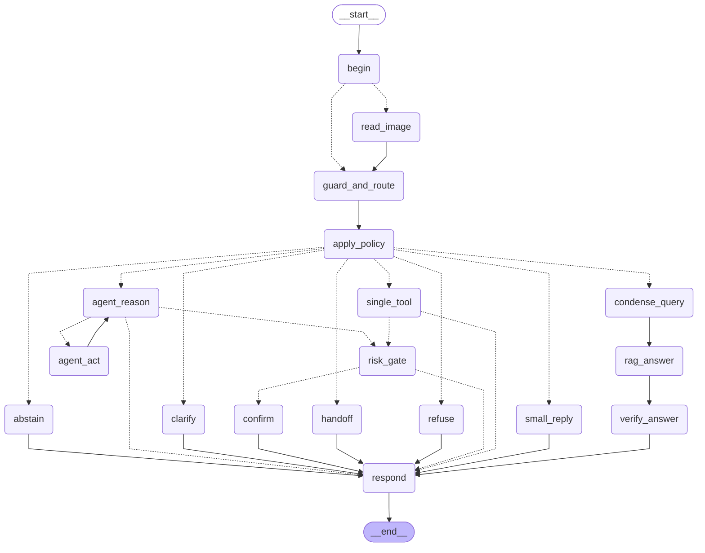

# Architecture

The copilot is one LangGraph `StateGraph` whose nodes are switched on by the capabilities of the active
profile (`graph/capabilities.py`). Code owns the workflow; at each branch point a System One decision model
(Laya, or the offline stub) supplies typed answers with probabilities; the chat model (Gemma 4 on
NVIDIA NIM or Google AI Studio) writes answers and reads images; SQLite and public APIs supply facts. Every
turn leaves a trace.

## The compiled graph (baseline profile)

Exported from the running code by `python scripts/export_graphs.py`; one diagram per build step lives in
`docs/build-path/diagrams/`.

## One turn

| Node | Job | Main modules |
|---|---|---|
| `begin` | reset per-turn state, measure the model window | `graph/memory.py` |
| `read_image` | vision model → transcription + draft event; per-field checks | `multimodal/notice_reader.py` |
| `guard_and_route` | ONE decision request: guards, route, arguments | `decisions/questions.py`, `decisions/laya.py` |
| `apply_policy` | thresholds and confidence bands → an action | `decisions/policy.py` |
| `clarify` / `refuse` / `handoff` / `abstain` | fixed replies (docs/implementation-plan.md §3.2) | `llm/prompts.py` |
| `condense_query` | rewrite a follow-up for retrieval, gated by `follow_up` | `rag/condense.py` |
| `rag_answer` | retrieve → judge passages → grounded answer | `rag/retrieve.py`, `rag/answer.py` |
| `verify_answer` | claim_support per sentence; regenerate once, then abstain | `graph/nodes.py` |
| `single_tool` | one tool with arguments filled by code | `graph/arguments.py`, `tools/` |
| `agent_reason` / `agent_act` | bounded loop, three modes, repeat detector | `graph/agent.py` |
| `risk_gate` / `confirm` | gate questions, then `interrupt()` until Confirm or Cancel | `graph/nodes.py` |
| `respond` | TurnResult, memory, trace | `schemas.py`, `observability/trace.py` |

## Design rules as implemented

1. One decision request per turn for guard, route, and arguments (`guard_and_route`).
2. Selection is not execution: only `tools/registry.py` runs registered code, after validation.
3. Identity never comes from a model: tools read `account_id` from the session; over MCP it travels as request metadata.
4. Writes always wait for a confirmation (`confirm` node); the risk gate can block but never approve.
5. Every node opens a span; secrets and foreign account IDs are redacted before a span is written.
6. Every external dependency has an offline twin: stub model, hashing encoder, stub decider, recorded fixtures.
7. Tool errors are data (`{"ok": false, "error": ...}`).
8. A rewrite feeds retrieval only; the original message stays in memory and in the answer prompt.
9. The checkpointer keeps the whole thread; each model call sees a trimmed window.
10. Neutral language everywhere, enforced by `scripts/check_language.py`.

## Data stores

| Store | Path | Content |
|---|---|---|
| Campus database | `runs/campus.db` | synthetic accounts, courses, sessions, rooms, bookings, books, loans, holds, assignments, events |
| Knowledge base | `runs/kb.db` | documents, chunks, embedding cache, ingest runs, FTS5 index, `vec0` table |
| Thread memory | `runs/memory.db` | LangGraph checkpoints per `thread_id` |
| Traces | `runs/traces/<date>.jsonl` | one line per span |
| HTTP cache | `runs/http_cache.sqlite` | public-API responses with a TTL per API |
