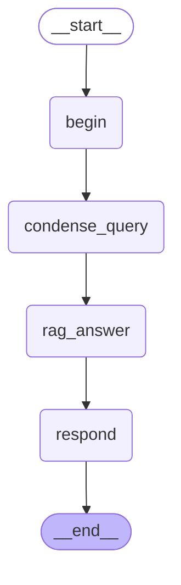

# Step 6 of 12: Remember the conversation

The compiled graph at this step (exported by `scripts/export_graphs.py`).

```mermaid
---
config:
  flowchart:
    curve: linear
---
graph TD;
	__start__([<p>__start__</p>]):::first
	begin(begin)
	respond(respond)
	rag_answer(rag_answer)
	condense_query(condense_query)
	__end__([<p>__end__</p>]):::last
	__start__ --> begin;
	begin --> condense_query;
	condense_query --> rag_answer;
	rag_answer --> respond;
	respond --> __end__;
	classDef default fill:#f2f0ff,line-height:1.2
	classDef first fill-opacity:0
	classDef last fill:#bfb6fc

```
