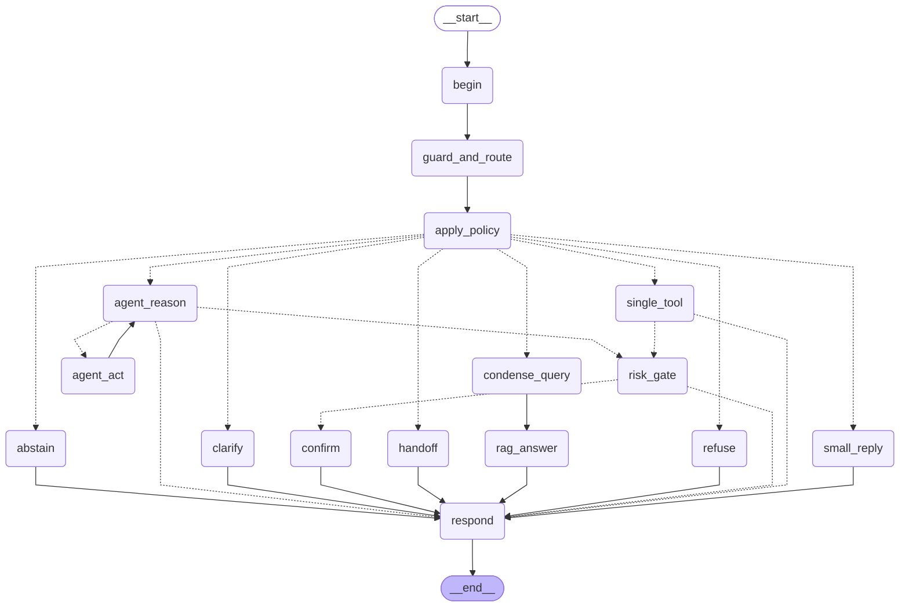

# Step 9 of 12: Agent loop and safe writes

The compiled graph at this step (exported by `scripts/export_graphs.py`).

```mermaid
---
config:
  flowchart:
    curve: linear
---
graph TD;
	__start__([<p>__start__</p>]):::first
	begin(begin)
	respond(respond)
	rag_answer(rag_answer)
	condense_query(condense_query)
	guard_and_route(guard_and_route)
	apply_policy(apply_policy)
	clarify(clarify)
	refuse(refuse)
	handoff(handoff)
	abstain(abstain)
	small_reply(small_reply)
	single_tool(single_tool)
	agent_reason(agent_reason)
	agent_act(agent_act)
	risk_gate(risk_gate)
	confirm(confirm)
	__end__([<p>__end__</p>]):::last
	__start__ --> begin;
	abstain --> respond;
	agent_act --> agent_reason;
	agent_reason -.-> agent_act;
	agent_reason -.-> respond;
	agent_reason -.-> risk_gate;
	apply_policy -.-> abstain;
	apply_policy -.-> agent_reason;
	apply_policy -.-> clarify;
	apply_policy -.-> condense_query;
	apply_policy -.-> handoff;
	apply_policy -.-> refuse;
	apply_policy -.-> single_tool;
	apply_policy -.-> small_reply;
	begin --> guard_and_route;
	clarify --> respond;
	condense_query --> rag_answer;
	confirm --> respond;
	guard_and_route --> apply_policy;
	handoff --> respond;
	rag_answer --> respond;
	refuse --> respond;
	risk_gate -.-> confirm;
	risk_gate -.-> respond;
	single_tool -.-> respond;
	single_tool -.-> risk_gate;
	small_reply --> respond;
	respond --> __end__;
	classDef default fill:#f2f0ff,line-height:1.2
	classDef first fill-opacity:0
	classDef last fill:#bfb6fc

```
